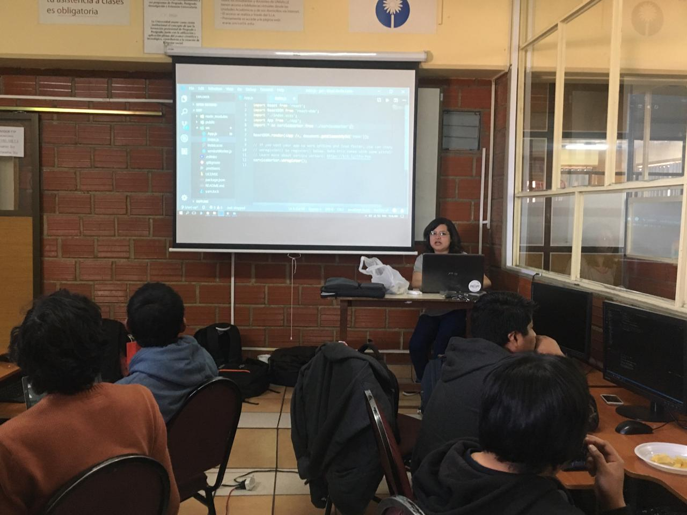
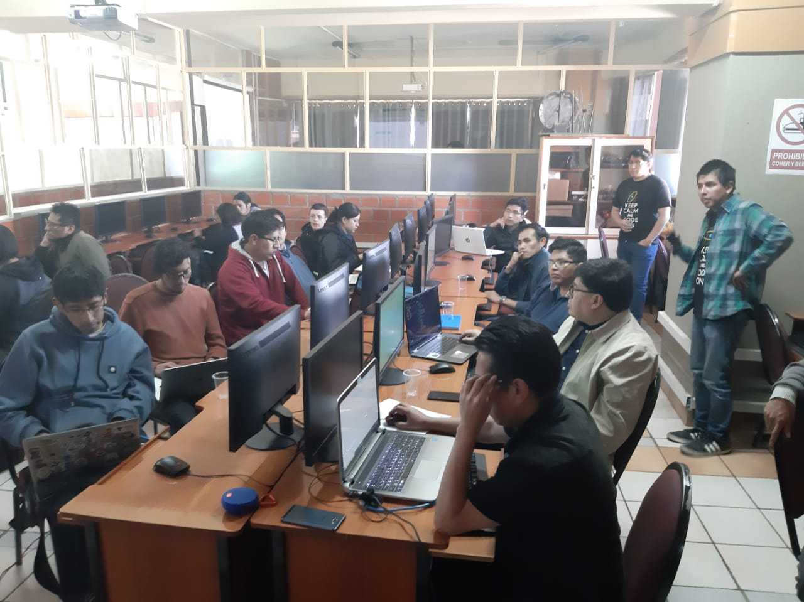
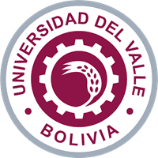
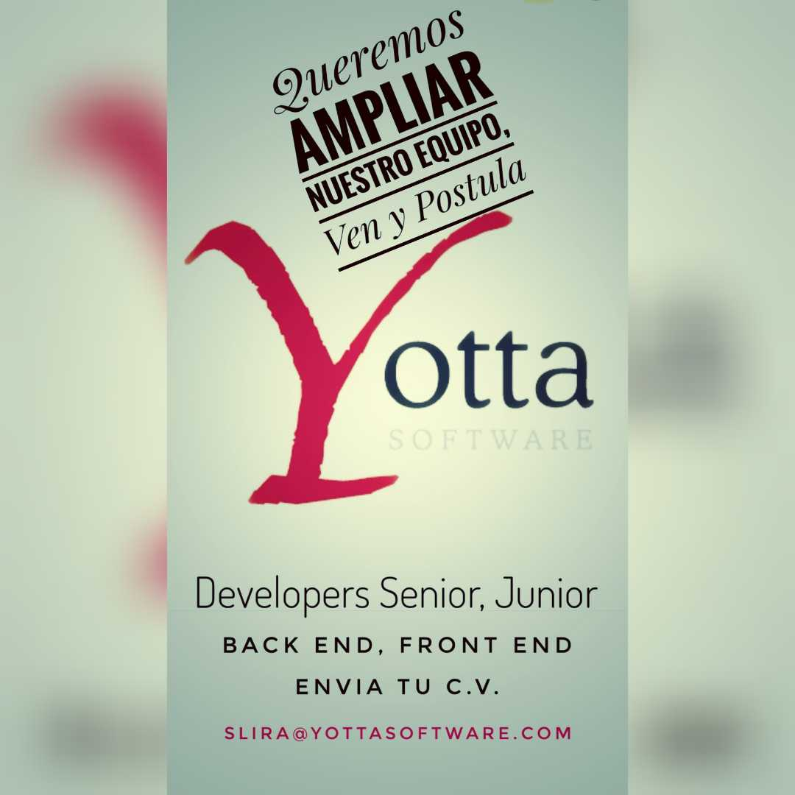

Saludos 

Como comunidad React Bolivia este pasado sabado 18 de Mayo llevamos a cabo nuestro primer Workshop de ReactJS inspirado en la serie Game of Thrones, en este Workshop a explicamos el desarrollo de una aplicación en ReactJS desde el principio con un ejemplo usando personajes de GoT. 

El proceso de organización comenzó con la publicación de un cuestionario con el que verficamos el nivel de conocimiento de los asistentes, no esperabamos tantos postulantes :) 😄 tuvimos aproximadamente 150 participantes, de los cuales seleccionamos a los 30 primeros para asistir al Workshop. Muchas gracias a todos por llenar el cuestionario!

### El workshop

 

Durante el Workshop explicamos los conceptos básicos de: ES6, cómo configurar tu entorno de trabajo, el proceso para crear tu primer componente, props, state, y acciones como agregar, editar y filtrar la lista de personajes, lamentablemete por falta de tiempo no logramos concluir todas las actividades que teníamos en agenda, asi que les mandamos el ejemplo completo y recursos con los que podrán seguir su proceso de aprendizaje.

- [Presentación](https://docs.google.com/presentation/d/1QixHhWykbw8X1a_35Y_SSmWcYwxvoaI1ZLvCCZBRyWU/edit?usp=sharing)
- [Demo del Workshop](https://competent-archimedes-56d8e4.netlify.com)
- [Repositorio](https://github.com/taoteach/react-fundamentals-with-got)

### ¿Que se viene?

Debido a la gran cantidad de personas que expresaron su interés por aprender ReactJS estamos planeando realizar mas talleres tanto en la ciudad de La Paz como en otras ciudades del país, asi que esten atentos a todas nuestras redes sociales y a todas las actividades que tengamos. 

### Nuestros Instructores 

Para el Workshop contamos con la gran ayuda de nuestros instructores 

- Veronica Clavijo [LinkedIn](https://www.linkedin.com/in/veronica-clavijo-altamirano/) [Twitter](https://twitter.com/Veuge_C)
- Mario Medrano [LinkedIn](https://www.linkedin.com/in/mario-medrano-maldonado/) [WhatsApp](https://wa.me/59177428660)
- Mauricio De La Quintana [LinkedIn](https://www.linkedin.com/in/mauriciodelaquintana/) [WhatsApp](https://wa.me/59160101082)
- Guillermo Paredes [LinkedIn](https://www.linkedin.com/in/guillermo-david-paredes-torrez/) [WhatsApp](https://wa.me/59160684585)

### Agradecimientos Especiales 

Nuestro agradecimiento especial por apoyarnos como React Bolivia para llegar a mas personas con una herramienta tan requerida que es React:

- Univalle: por brindarnos buenos ambientes para hacer el laboratorio.

- YottaSoft: Por auspiciarnos para souvenirs y refrigerios durante el workshop.

