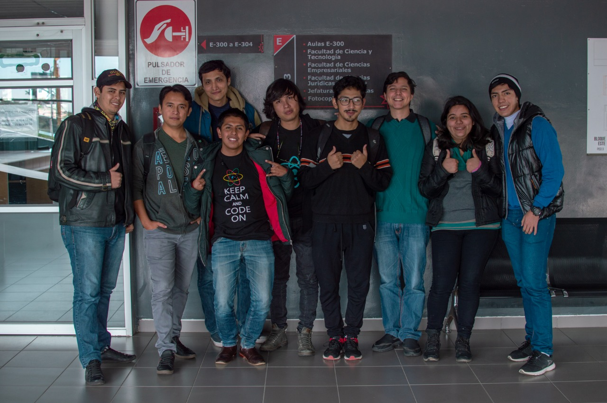
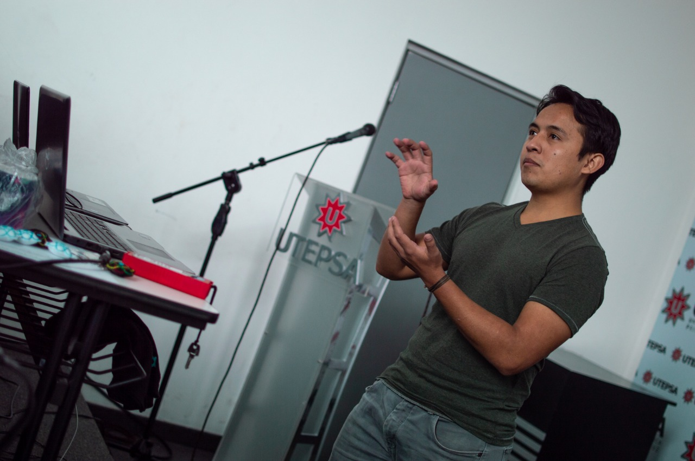
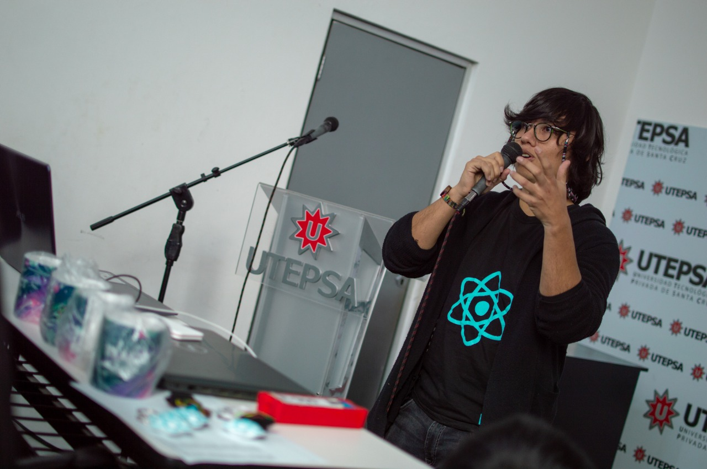
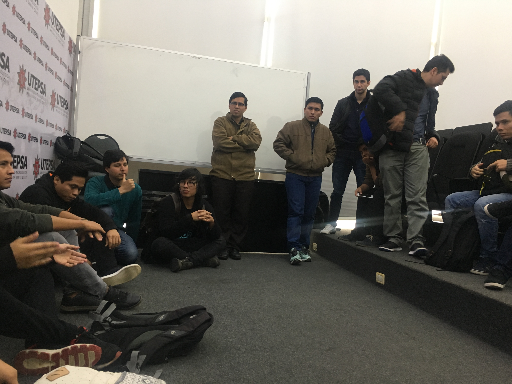
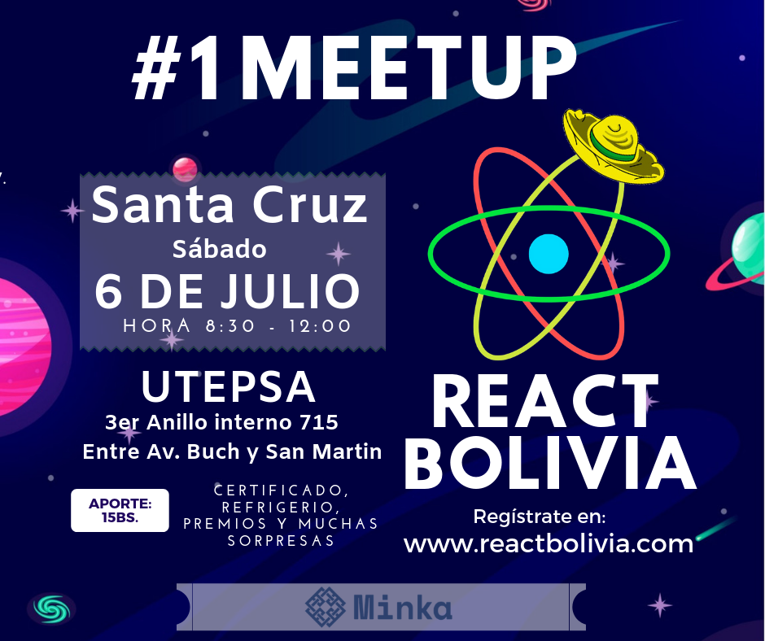

 

El pasado **06 de Julio de 2019**, se realizó el primer meetup en la ciudad de **Santa Cruz** en la Universidad Privada Tecnológica de Santa Cruz (UTEPSA), con la exposición de 4 speakers, la participación de 30 personas y el registro de 69 personas, lastimosamente no todas pudieron asistir.

Entre los speakers se tuvo la participación de 4 personas:

* Arnold Gandarillas - TDD in React
* Luis Barrancos - Class Component vs Functional Component
* Guido Quispe - Typechecking and Flow
* Kleber Rivamontan - Primeros pasos con Gatsby

## Arnold Gandarillas - TDD in React

 

Arnold explico la importancia de realizar un desarrollo orientado a los tests (TDD - Test Driven Development), en la que la primera regla es *que el test debe fallar*, de esa forma se puede ir desarrollando el test de forma que cumpla el criterio de aceptación. Arnold ejemplifico el TDD mediante tests realizados a componentes de ReactJS **en vivo**.

Más información en: [TDD en React](https://medium.com/@rossbulat/test-driven-development-in-react-with-jest-and-enzyme-2a6cf2cc3071) 

## Luis Barrancos - Class Component vs Functional Component

 

Luis vino con las novevades que trae React en la versión 16.8, en su exposición dio la explicación sobre las diferencias entre componentes basados en *clases* y componentes basadas *funciones o hooks*. 
Resaltó que los componentes de tipo *hook* abstraen y reducen la cantidad de código, la lógica al crear componentes con React. Los puntos a desatacar son:
* Si tu aplicación funciona con class components, déjala así.
* Los class components y hooks no pueden funcionar juntos.
* Si estás empezando con React, usa hooks.

Más información en: [React Hooks](https://es.reactjs.org/docs/hooks-intro.html)

## Guido Quispe - Typechecking and Flow

 

Guido hablo sobre la importancia de *tipear* las variables en Javascript, esto por que Javascript es un lenguaje no tipado por defecto, pero como explico existen dos herramientas que ayudan a sobrellevar este problema (especialmente para validaciones):

* Typescript
* Flow

Ambas son herramientas recomendables para validar el tipo de variables que se usan en el entorno de Javascript, recomendando a **Typescript**.

Más información en: [Flow](https://flow.org/) y [Typescript](https://www.typescriptlang.org/)

# Kleber Rivamontan - Primeros pasos con Gatsby

 

Por último Kleber hablo sobre un generador de páginas estáticas basado en React, **Gatsby** una herramienta para crear páginas web estáticas y con la posiblidad de volverlas dinámicas mediante llamadas a API's externas, destaco la versatilidad y facilidad para crear un sitio en pocos pasos, y la **rapidez** que tiene Gatsby para desplegar el contenido, siendo una herramienta bastante optimizada para temas de SEO.

Más información en: [Gatsby](https://www.gatsbyjs.org/)

## Keynote

 

Una vez finalizada las presentaciones de los expositores se procedió a una ronda de *networikng* por parte de los participantes, para que puedan conocerse a un nivel más personal y profesional.

Entre los comentarios destaca el entusiasmo por participar en más actividades de React Bolivia en Santa Cruz, especialmente orientados a talleres prácticos en la que se puedan entender el funcionamiento técnico de React.

##### Nota. Si quieres colaborar con @ReactBolivia envia un mensaje a: **comunity.react.bolivia@gmail.com** con el "ASUNTO: REACTBOLIVIA - COLABORAR".

