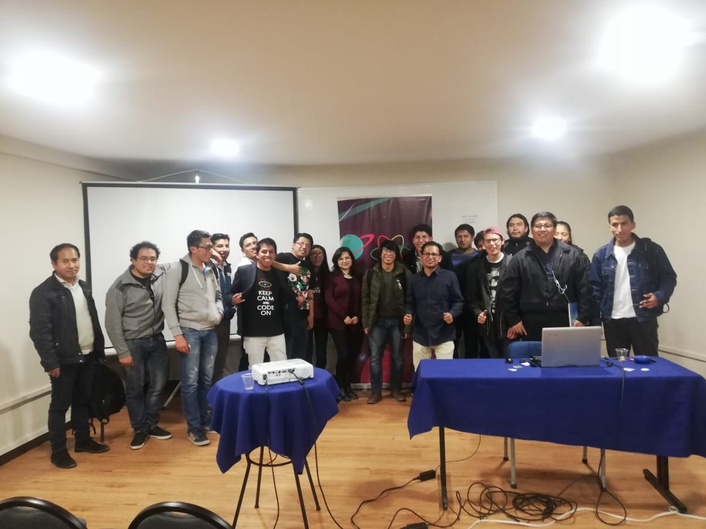
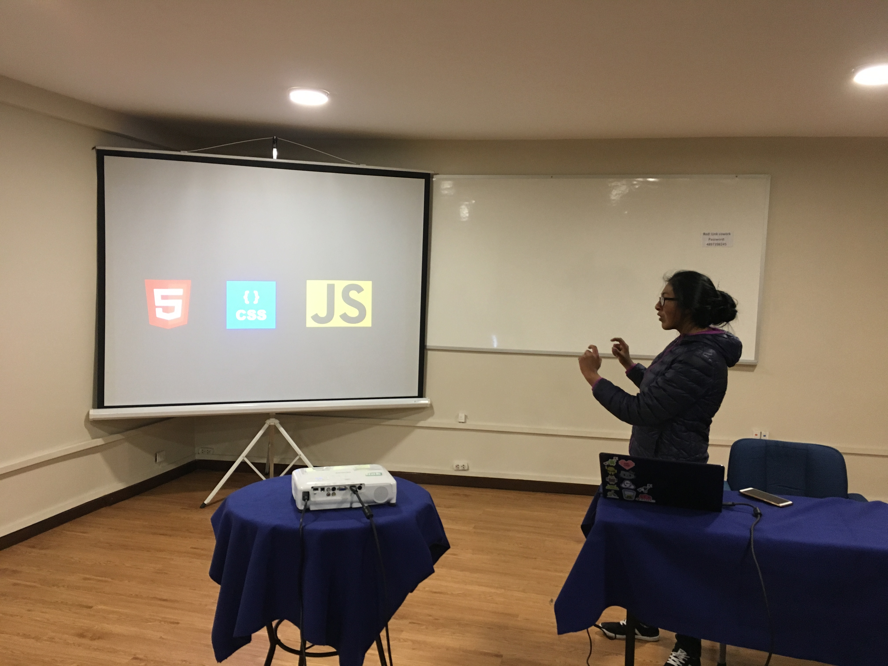
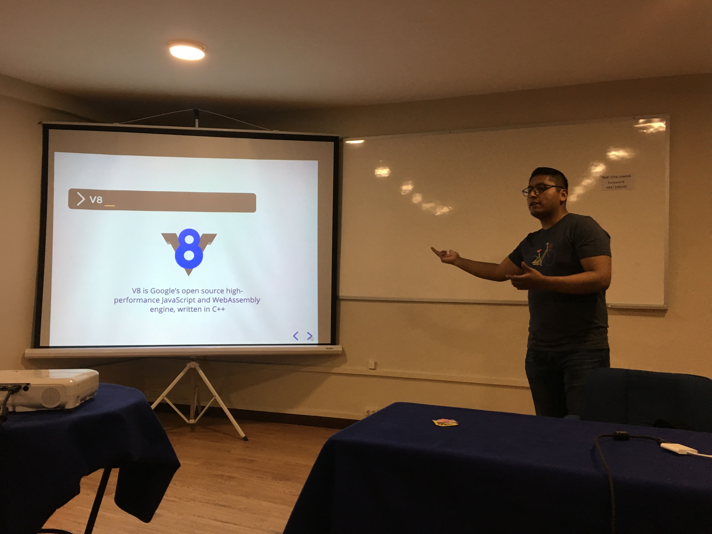
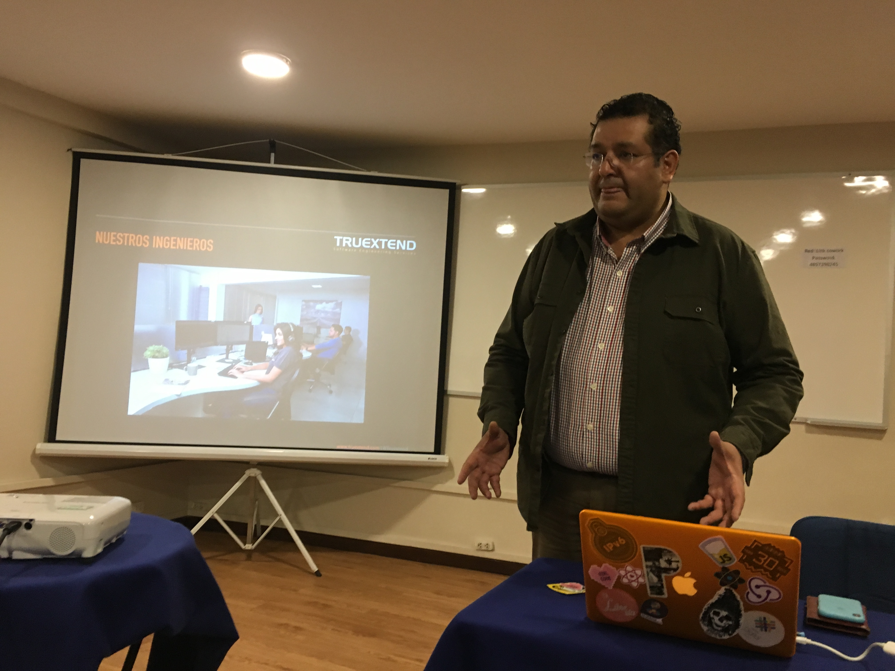
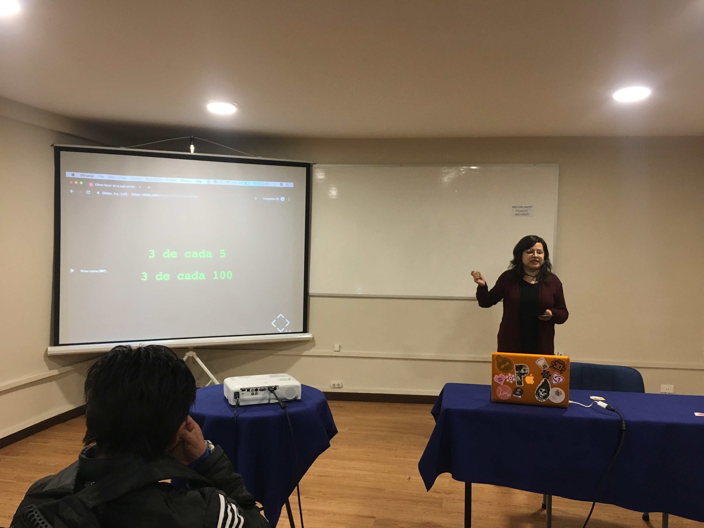
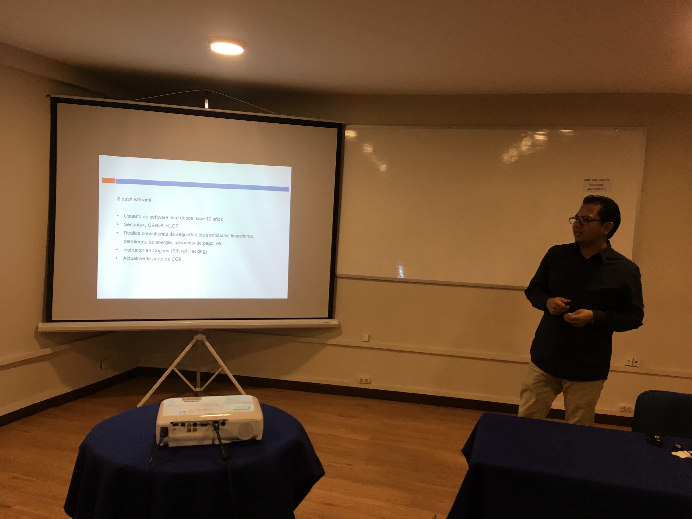

# ¿Comunidad de comunidades?

En el mundo de la tecnología, es usual encontrar eventos de apasionados que se reúnen en torno a un lenguaje de programación, una temática común o alguna nueva herramienta. Sin embargo, lo que propusieron los jóvenes de React Bolivia, fue algo más disruptivo, *propiciando un espacio de circulación entre distintas comunidades tecnológicas.*

El evento, denominado "React And Friends" fue realizado el pasado 12 de julio en LINK COWORK, ubicado en la ciudad de La Paz. Este meetup tuvo el objetivo de compartir con otras comunidades, como es el caso de GDG La Paz y Security in Action. Se abordaron temas de seguridad web, introducción a Reactjs, Accesibilidad en la web y Javascript.

La primera ponencia, a cargo Wilma Limachi detalló el desarrollo de frontend con la utilización de funcionalidades de React, resaltando que ésta tiene una licencia de código abierto (Open Source). 

 

Luis Miguel Mantilla, de GDG La Paz continuó el evento con su ponencia "Build the Future con Javascript", en la que afirmó que "Javascript is everywhere". Detalló que éste es uno de los lenguajes de programación que comenzó dando mayor interactividad a las páginas, pero que ahora se ha convertido en mucho más. De esta forma concluyó la primera parte del meetup. 

 

Durante el intermedio, se tuvo la visita de TRUEXTEND, una empresa boliviana que presentó oportunidades laborales para Desarrolladores. Su representante señaló que aportan a Bolivia 5MM de dólares en impuestos, asimismo resaltó la inclusión de la mujer en TIC, enfatizando que el 40% de sus ingenieras son mujeres. Concluyó otorgando una beca de entrenamiento de 6 meses al participante que llegó primero al evento. 

 

Desde México y por videollamada, Charlie López, presentó su ponencia "Thank you Next.js", donde detalló la herramienta Next JS, que sirve para realizar renderizado desde el lado del servidor (Server Side Rendering) mediante React, lo cual permite optimizar el tiempo de carga de páginas web. 

 

Continuando con el evento, Verónica Clavijo en su ponencia "Cómo hacer de la web un lugar más accesible", desarrolló los principios de "Accesibility" (Accesibilidad en Español, más conocido como "A11y"), lo cual permite que los desarrollos web consideren funcionalidades para que su uso sea cómodo para personas con capacidades diferentes o con ciertas limitaciones de en su conexión. La expositora brindó recomendaciones que los desarrolladores podrán implementar en sus sitios web. 
 

Para cerrar el evento, Daniel Torres presentó su ponencia "Probando la seguridad de tu aplicación web", durante la cual realizó demostraciones bastante didácticas sobre vulneraciones a sitios web y la forma de prevenir estos ataques. 
 

Sin duda los participantes de "React and Friends" se han llevado muchos conocimientos. Estaremos a la expectativa de futuros eventos de esta joven comunidad que reunió a gente en tecnología en un evento de compartimiento. Si están interesados en las actividades de React Bolivia, les recomiendo visitar su sitio web www.reactbolivia.com. 

## Entrevistas por Judith Apaza

<iframe width="560" height="315" src="https://www.youtube.com/embed/K20xy61q_fY" frameborder="0" allow="accelerometer; autoplay; encrypted-media; gyroscope; picture-in-picture" allowfullscreen></iframe>

<iframe width="560" height="315" src="https://www.youtube.com/embed/QMr8a4sxAvE" frameborder="0" allow="accelerometer; autoplay; encrypted-media; gyroscope; picture-in-picture" allowfullscreen></iframe>

<iframe width="560" height="315" src="https://www.youtube.com/embed/_HQDInCtSMg" frameborder="0" allow="accelerometer; autoplay; encrypted-media; gyroscope; picture-in-picture" allowfullscreen></iframe>

##### Nota. Si quieres colaborar con @ReactBolivia envia un mensaje a: **comunity.react.bolivia@gmail.com** con el "ASUNTO: REACTBOLIVIA - COLABORAR".

