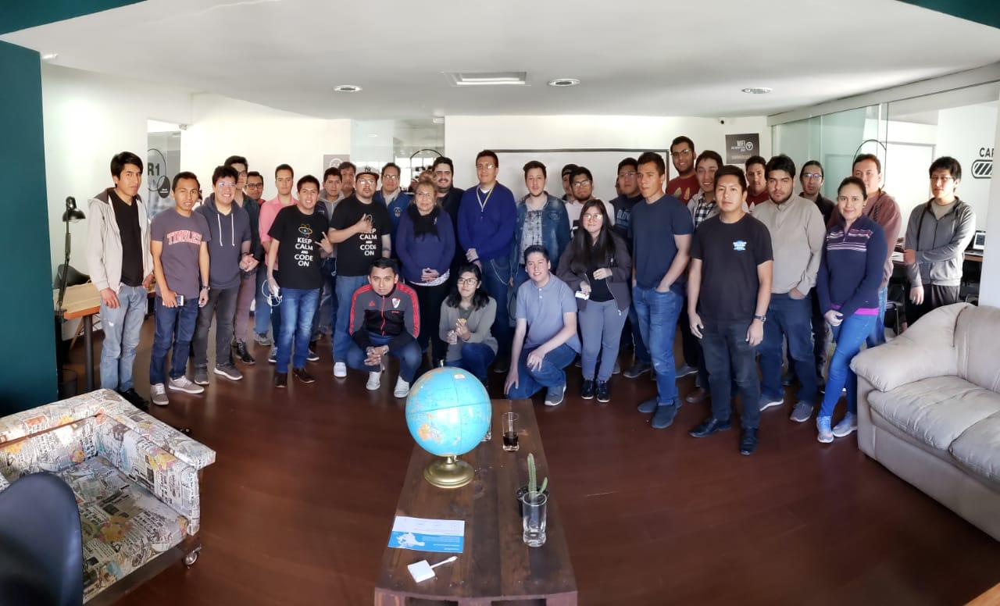

# Primer workshop de React en Cochabamba

El evento, denominado "Primeros pasos con React - Workshop Cochabamba" fue realizado el pasado 27 de julio en 360 Workplace, ubicado en la ciudad de Cochabamba. Este workshop tuvo el objetivo de dar una introducción práctica a la herramienta de desarrollo web y móvil, [React JS](https://reactjs.org).

Se conto con la presencia de 32 participantes, el staff de organización de la comunidad React Bolivia en Cochabamba y el apoyo de 3 organizaciones: [AssureSoft](https://www.assuresoft.com/), [EDteam](https://ed.team) y [360 Workplace](http://360workplace.com/).

El workshop se dividió en 3 fases: 
- Explicación de Git, instalación de dependencias y componentes presentacionales.
- Componentes basados en clases, eventos y ciclo de vida.
- Peticiones HTTP y actividad práctica.

# Beto Quiroga - Instalación, Git y componentes presentacionales

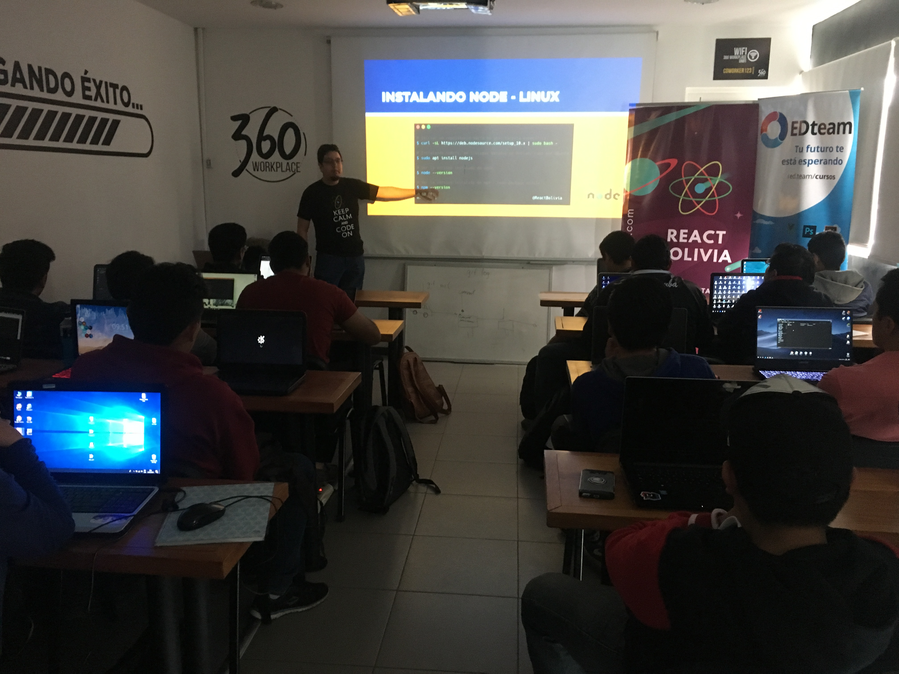 

La primera ponencia, a cargo de Beto Quiroga de EDteam, explicó el funcionamiento de la herramienta de versionamiento **Git** de una forma básica pues se usaría bastante a lo largo del workshop.

Beto hizo una analogía de Git con un viaje en carretera: Un repositorio es como un auto que viaja en la carretera, en el momento que el auto inicia el viaje se crea repositorio añadiendo los archivos iniciales (*git init*), y a medida que el auto continúa su viaje, se van dejando rastros en ciertos puntos para poder saber como volver (*commit*), de esta forma es posible regresar a cualquier punto del camino si es necesario.

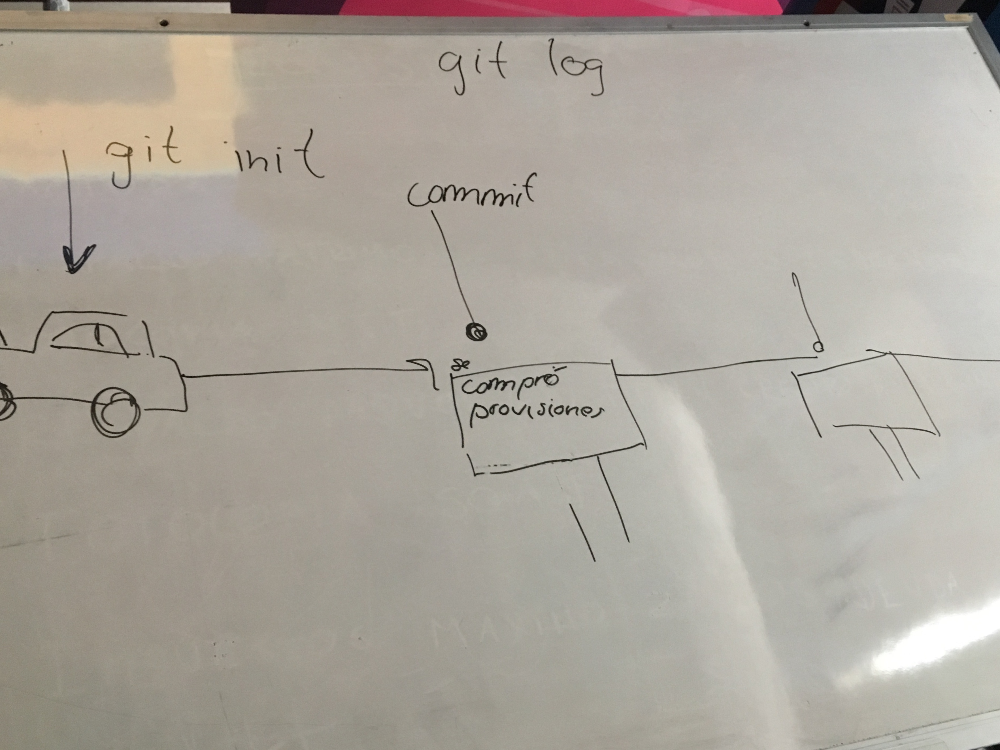 

# [Guillermo Paredes](https://www.linkedin.com/in/guillermo-david-paredes-torrez/) - Componentes basados en clases, eventos y ciclo de vida

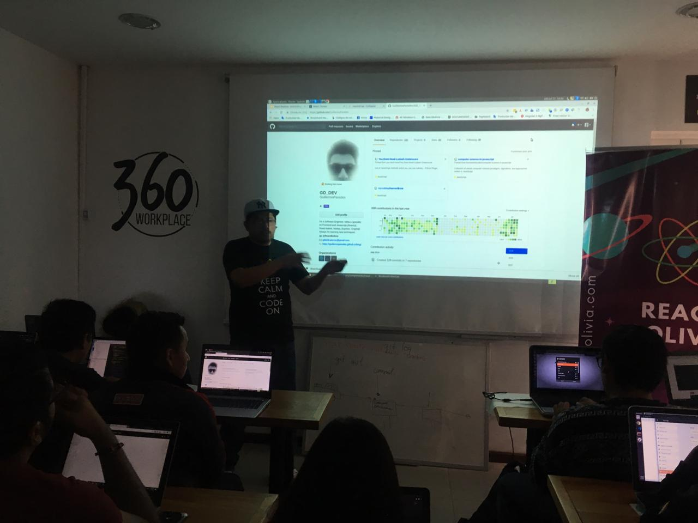 

Guillermo Paredes, organizador de React Bolivia, continuó el taller explicando la importancia de los componentes basados en clases, que escencialmente son útiles al momento de tener un *estado* en los componentes, esto significa que se pueden almacenar y actualizar variables dentro ese componente para que pueda realizar acciones dinámicas, la función que destaca para realizar la actualización del estado es `setState()`. Toda la explicación fue acompañada de un ejemplo, un **TODO LIST**, que tenía por objetivo agregar objetos a una tabla mediante un formulario, a continuación se explicaron eventos en React, como `onChange` para reaccionar ante cada evento de tecla en un campo de input y luego el evento `onClick` al presionar un botón. 

# Oportunidades laborales con AssureSoft

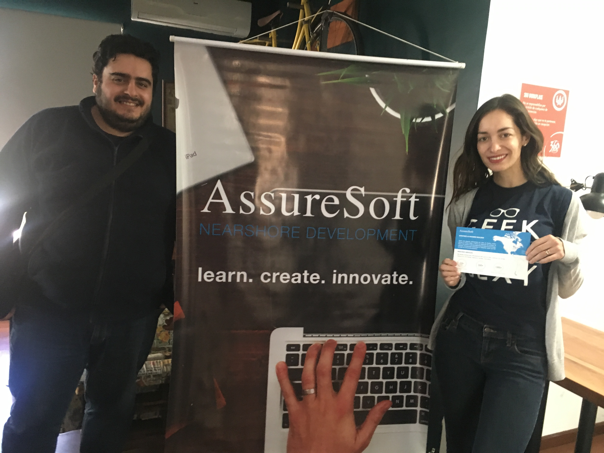 

Tuvimos el grato apoyo de la empresa de desarrollo de software **AssureSoft** con base en *Silicon Valley* y *Cochabamba*, que expusieron oportunidades de trabajo a los participantes, para más información enviar CV's a *careers@assuresoft.com*

# [Pablo M. Jordan](https://www.linkedin.com/in/pablo-diego-montes-jordan-30a16b117/) - REST API, Axios y actividad práctica (generador de memes)

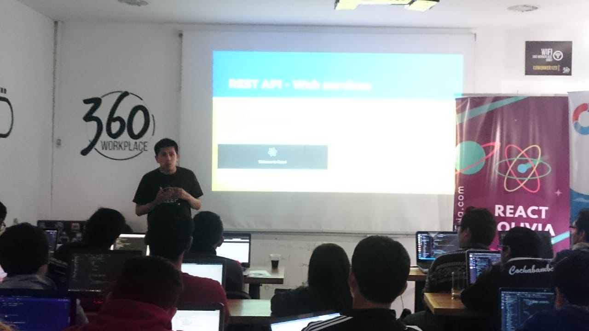 

Pablo M. Jordan, organizador de React Bolivia, finalizó el taller con la explicación de la arquitectura REST API, que permite a las aplicaciones consumir servicios de terceros, para realizar esta acción se requiere hacer peticiones HTTP para obtener datos, bajo determinadas reglas, cabe destacar que React, **solamente esta diseñado para crear Interfaces de Usuario (UI), no así para almacenar datos o archivos (trabajo del servidor), y se puede consumir datos de cualquier backend desarrollado en cualquier lenguaje de programación**. 
El cliente HTTP que se utilizó en el taller fue [**Axios**](https://github.com/axios/axios), conocido por su compatibilidad.

En la última fase se planteó un desafío a los participantes, estos debían completar una tarea: codificar un **Generador de memes en React**. 

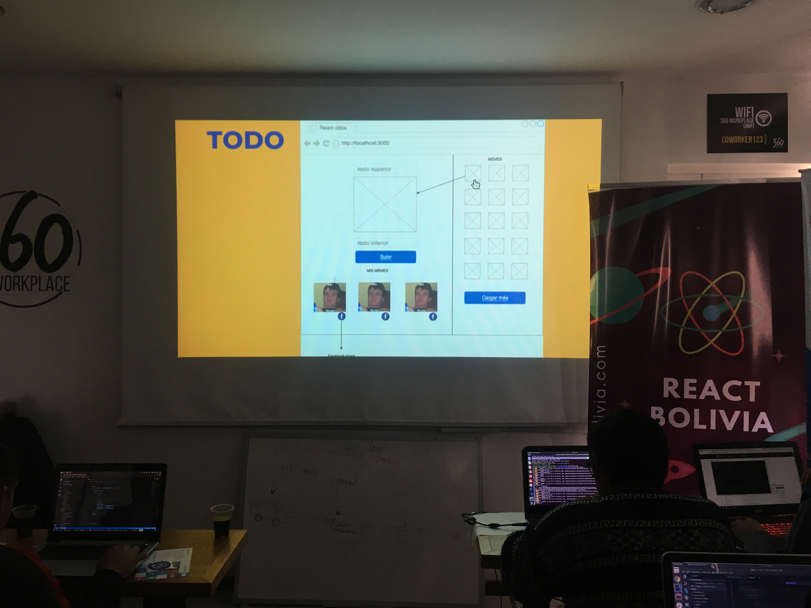 

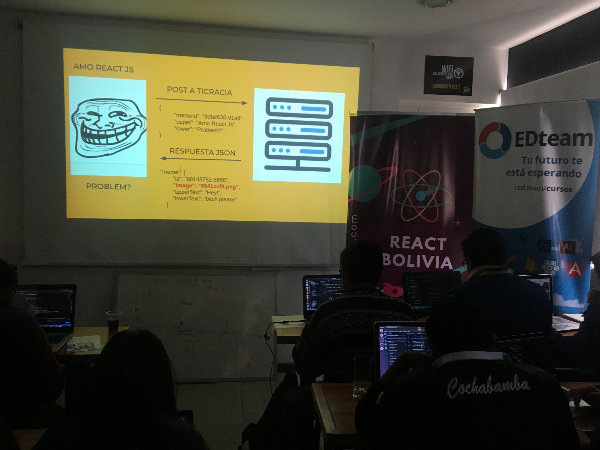

El desafío consistía en utilizar la API pública de [TIcracia](https://ticracia.com) para editar memes, TIcracia es una startup para incentivar de participación ciudadana, siendo Pablo M. Jordan el fundador de la misma. Se elije una imagen de la galería de *memes base*, al elegir uno de ellos se mostraba en la parte principal de la pantalla, se agregaba un *texto superior* y un *texto inferior*, y al presionar el botón de "Subir", se enviaría una petición HTTP para crear una nueva imagen editada mediante el servidor de TIcracia, de esa forma crear su galería de memes propios y como acto final agregar un enlace para compartir en **Facebook** (la solución puede observarse en el [repositorio publico](https://github.com/ReactBolivia/Workshop1-CBBA). Al final de la actividad hubieron 3 ganadores que recibieron tazas y agendas provistas por el auspiciador **Assure Soft**.

 

Sin duda los participantes de "Primeros pasos con React - Workshop Cochabamba" se han llevado muchos conocimientos prácticos sobre el uso y funcionamiento de ReactJS. Debido a la amena experiencia cochabambina, la comunidad React Bolivia seguirá realizando más eventos prácticos y meetups para aportar al conocimiento de ingeniería web y móvil, incentivar la investigación, conectar a los participantes con posibles trabajos en empresas de software y *networking* así como la colaboración con otras comundiades del medio y distintas actividades relacionadas con el desarrollo tecnológico en Cochabamba.

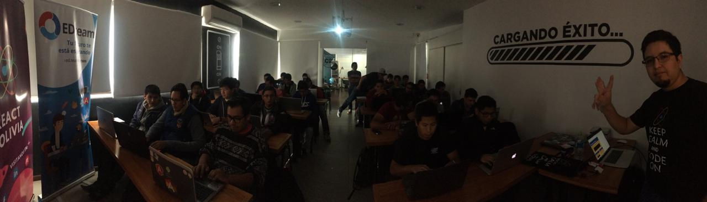 

## Keynote - Alvaro Mamani, ganador de la actividad

<iframe width="560" height="315" src="https://www.youtube.com/embed/621r3NQWtm8" frameborder="0" allow="accelerometer; autoplay; encrypted-media; gyroscope; picture-in-picture" allowfullscreen></iframe>

## Nuestros auspiciadores
 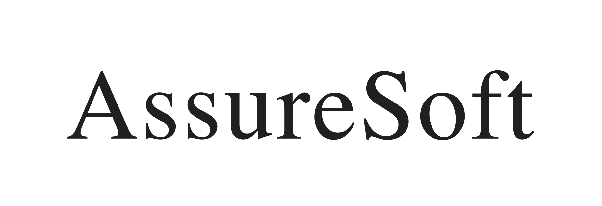 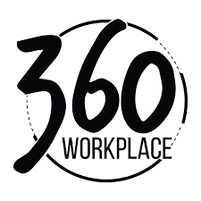  

## Material

[Enlace a la presentación](https://docs.google.com/presentation/d/1muEAUspuoXmUh4faNUjf2GbqXQUqcpOYgW05qA-a5xo/edit?usp=sharing)

[Repositorio de actividad (solución)](https://github.com/ReactBolivia/Workshop1-CBBA)

##### Nota. Si quieres colaborar con @ReactBolivia envia un mensaje a: **comunity.react.bolivia@gmail.com** con el "ASUNTO: REACTBOLIVIA - COLABORAR".

